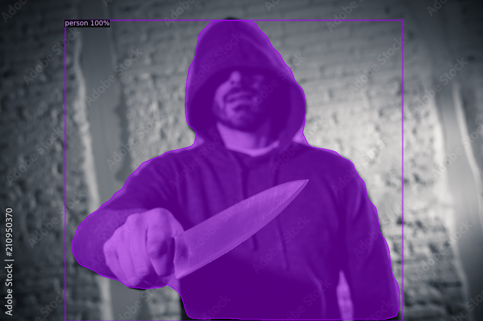
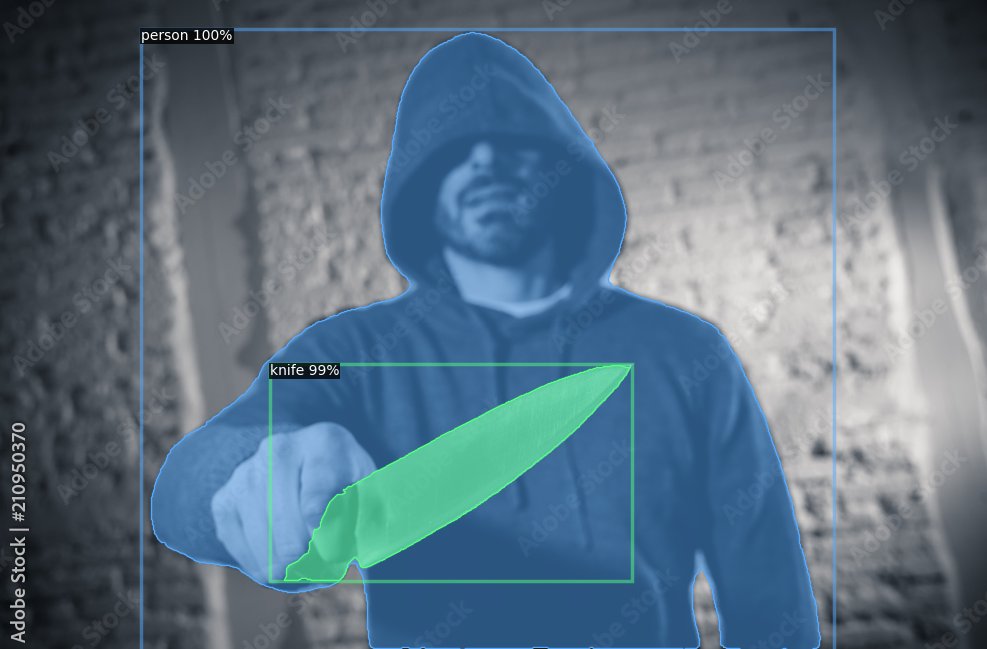
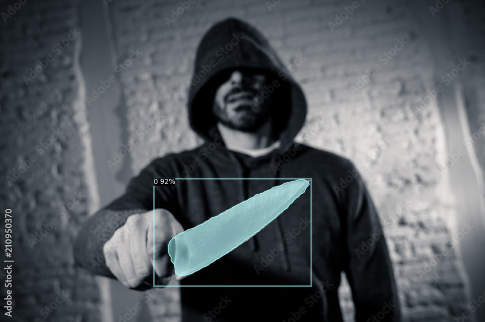

# Detectron2

This project is for experiment only.
Please follow the licensing provided by the creator of the software.

## Installation & Setup

### Install

- Clone detectron2 and build it.

### Setup

- Build it.

## Device Hander

- Device Handler Cuda vs CPU

## Detection Types

- Tested the detectron2 with different types of detections:
  - Object detection
  - Keypoints Detection
  - Instant Segmentation
  - Instant Segmentation with Rend Point
  - Panoptic Segmentation

## Custom dataset

[Data Set](https://github.com/ari-dasci)
[Use Custom Datasets](https://detectron2.readthedocs.io/en/latest/tutorials/datasets.html)

- Used a subset of OD-WeaponDetection: Knife_detection to build the custom dataset to train the model
- Used label_me to draw the boxes around the object
- Used label-me-2-coco to convert the json file into coco data format

### Testing  on prebuild dataset

- Testing the model on a pre-trained dataset with instant segmentation. we can see that the model only detected the Peron object
  
- testing the model again with instant segmentation and rend point on the same image.
 
- We notice that the model detected the person at 100% accuracy and the knife at 99%

### Testing on custom dataset

- The dataset is a small set of 100 images for training and 10 images for testing
 
- Our model gave us a 92% accuracy on a model trained on a custom dataset to detect knives.
- Even though the dataset we used was small the detection of knives is not that bad.
- The accuracy of the model increased when we increased the iteration of the model.
- The higher the # of iteration the higher the accuracy.
